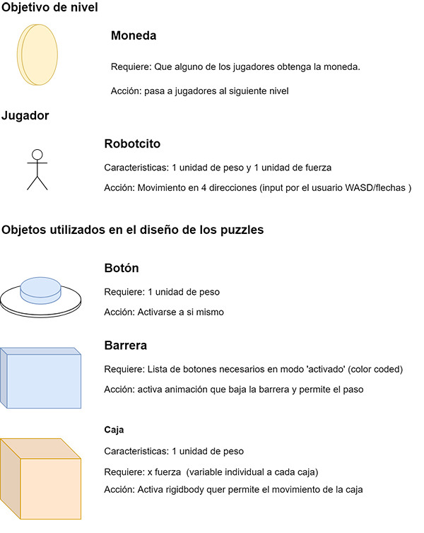

# Asymmetric Puzzle 
WebSocket Multiplayer Puzzle
  
## Sobre el proyecto
||||||
| Implementar Websocket | | | | |
| Para la comunicación de clientes y servidores | | | | |

## Sobre el equipo
Proyecto realizado para la materia de Ingeniera de Software para la maestría de Ciencias de la Computación en CINVESTAV Guadalajara. Entrega Diciembre 2020.
* Profesor: 
  * Dr. Félix Francisco Ramos Corchado
* Equipo de desarrollo:
  * Lic. Julia Alejandra Rodríguez Abud
  * Mtro. Carlos Cárdenas Ruiz
  * Ing. Gustavo Orozco
